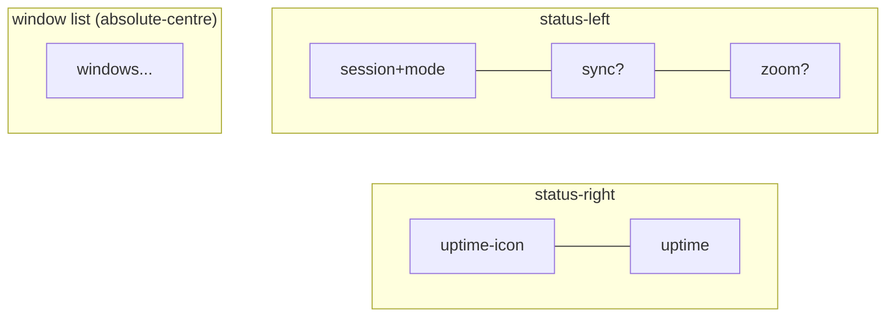

# AGENTS.md

tmux config with custom Catppuccin Mocha status bar.

## Status Bar Layout



- **Session+mode**: Icon and color change per mode; always shows icon + session
  name. Normal=teal tmux, prefix=red rocket, copy=blue copy, tree=teal list,
  clock=mauve clock
- **Sync indicator**: Peach sync icon when panes are synchronized (standalone)
- **Zoom indicator**: Mauve zoom icon when pane is zoomed (standalone)
- **Windows**: Absolute-centred list (active=█ prefix + bold rosewater, last=lavender)
- **Uptime**: Rosewater hourglass icon with `D:HH:MM` format (muted text)
- **Separator**: Second status line draws a `―` bar across full terminal width

### Session Module Modes

| Mode   | Icon   | Color | Notes                        |
| ------ | ------ | ----- | ---------------------------- |
| Normal | tmux   | teal  | Default state                |
| Prefix | rocket | red   | Highest priority             |
| Copy   | copy   | blue  | Any pane mode (lowest)       |
| Tree   | list   | teal  | Session/window picker        |
| Clock  | clock  | mauve | Clock display                |

Priority: prefix > tree > clock > copy > normal

Sync is a separate standalone indicator (peach sync icon), not in cascade.

### Window Indicators

| State    | Style                |
| -------- | -------------------- |
| Normal   | subtext0             |
| Current  | rosewater, bold, █ prefix |
| Last     | lavender             |
| Activity | Asterisk (\*) suffix |
| Bell     | red                  |

## Colors (`@cp-`)

All colors defined as Catppuccin Mocha hex values:

```bash
@cp-rosewater "#f5e0dc"  # Current window, uptime icon
@cp-flamingo  "#f2cdcd"
@cp-pink      "#f5c2e7"
@cp-mauve     "#cba6f7"  # Zoom indicator, clock mode
@cp-red       "#f38ba8"  # Prefix mode, bell
@cp-peach     "#fab387"  # Sync mode, current search match
@cp-yellow    "#f9e2af"  # Search matches
@cp-teal      "#94e2d5"  # Session, tree mode, messages
@cp-blue      "#89b4fa"  # Copy mode, clock digits
@cp-lavender  "#b4befe"  # Last window, active pane border
@cp-text      "#cdd6f4"  # Popup text
@cp-subtext1  "#bac2de"
@cp-subtext0  "#a6adc8"  # Normal windows
@cp-overlay1  "#7f849c"  # Muted text (uptime)
@cp-overlay0  "#6c7086"  # Inactive border, message/menu bg
@cp-surface1  "#45475a"  # Popup border
@cp-surface0  "#313244"  # Selection background
@cp-bg        "#1e1e2e"  # Popup background
@cp-crust     "#11111b"  # Search match foreground
```

## Style Helpers (`@style-`, `@bg-`)

Reusable style fragments:

```bash
@style-text      "fg=#{@cp-text}"      # Primary text
@style-muted     "fg=#{@cp-overlay1}"  # Muted/secondary text
@style-inactive  "fg=#{@cp-overlay0}"  # Inactive elements
@style-accent    "fg=#{@cp-mauve}"     # Accent color
@style-highlight "fg=#{@cp-lavender}"  # Highlight color
@bg-overlay      "bg=#{@cp-overlay0}"  # Overlay background
```

## Icons (`@i-`)

Nerd Font glyphs with trailing space:

| Icon      | Variable    | Unicode | Usage              |
| --------- | ----------- | ------- | ------------------ |
| tmux      | `@i-tmux`   | `ebc8`  | Normal mode        |
| rocket    | `@i-prefix` | `f427`  | Prefix mode        |
| copy      | `@i-copy`   | `f4bb`  | Copy mode          |
| sync      | `@i-sync`   | `f46a`  | Synchronized panes |
| clock     | `@i-clock`  | `f43a`  | Clock mode         |
| list      | `@i-tree`   | `f03a`  | Tree mode          |
| zoom      | `@i-zoom`   | `f002`  | Zoomed pane        |
| tab       | `@i-window` | `f04e9` | Window list header |
| hourglass | `@i-uptime` | `f4e3`  | Uptime display     |

## Module System

Modules use `#{E:@var}` expansion for nested variable resolution. Line
continuation (`\`) used for readability.

### Mode Detection (`@mode-is-*`)

Boolean checks for debugging with `tmux display -p "#{E:@mode-is-prefix}"`:

```bash
@mode-is-prefix  # Client is in prefix mode
@mode-is-tree    # In tree mode
@mode-is-clock   # In clock mode
@mode-is-copy    # In any special pane mode
```

### Module Variables (`@m-*`)

Composed modules expanded via `#{E:@m-name}`:

```bash
@m-session # Combined session+mode: icon+color change per mode, always shows #S
@m-sync    # Peach sync icon (conditional, standalone)
@m-zoom    # Mauve zoom icon (conditional, standalone)
@m-uptime  # Rosewater hourglass + D:HH:MM uptime
```

## External Scripts

### tmux-uptime

OS-aware uptime script at `~/bin/tmux-uptime`:

- **macOS**: Uses `sysctl kern.boottime`
- **Linux**: Reads `/proc/uptime`
- **Output**: `D:HH:MM` format (e.g., `1:04:02`)

Called from status-right via `#(tmux-uptime)`.

### tmux-separator

Draws a `―` separator bar at `~/bin/tmux-separator`:

- Uses `tmux display -p '#{client_width}'` for exact terminal width
- Called from `status-format[1]` via `#(tmux-separator)`

### agent-popup.sh

Agent popup manager at `~/.config/tmux/agent-popup.sh`:

- Single `_agent` session with `parent:suffix` window naming (e.g., `dotfiles:button`)
- Prompts for instance name on `Prefix+a`; empty → timestamp suffix (e.g., `143052`)
- New windows insert after last window with same parent (keeps projects grouped)
- Reattaches if window already exists; creates new otherwise
- Receives `$PARENT`, `$DIR`, `$SUFFIX` env vars via `command-prompt` expansion
- Runs `claude` command (configurable for other CLI agents)
- `Prefix+d` to close popup (detach from `_agent` session)

## Key Bindings

| Binding           | Action                              |
| ----------------- | ----------------------------------- |
| `Ctrl+Space`      | Prefix key                          |
| `Prefix+R`        | Reload config                       |
| `Prefix+a`        | Agent popup (prompts for name)      |
| `Prefix+A`        | Switch agent windows (choose-tree)  |
| `Prefix+p/n`      | Previous/next window (repeatable)   |
| `Prefix+P/N`      | Move window left/right (repeatable) |
| `Prefix+"`        | Split vertical (current path)       |
| `Prefix+%`        | Split horizontal (current path)     |
| `Prefix+[`        | Enter copy mode                     |
| `v` (copy mode)   | Begin selection                     |
| `C-v` (copy mode) | Toggle rectangle selection          |
| `y` (copy mode)   | Yank (stays in copy mode)           |

## Other Settings

| Setting             | Value | Purpose                    |
| ------------------- | ----- | -------------------------- |
| `mouse`             | on    | Mouse support              |
| `mode-keys`         | vi    | Vi-style copy mode         |
| `status-keys`       | emacs | Emacs in command prompt    |
| `history-limit`     | 50000 | Scrollback buffer          |
| `display-time`      | 4000  | Message display (4s)       |
| `escape-time`       | 0     | No escape key delay (vim)  |
| `status-interval`   | 5     | Status refresh (5s)        |
| `status`            | 2     | Two status lines           |
| `repeat-time`       | 1000  | Repeatable timeout (1s)    |
| `base-index`        | 1     | Windows start at 1         |
| `pane-base-index`   | 1     | Panes start at 1           |
| `renumber-windows`  | on    | Auto-renumber on close     |
| `monitor-activity`  | on    | Detect background activity |
| `visual-activity`   | off   | Suppress activity messages |
| `focus-events`      | on    | Pass focus events          |
| `aggressive-resize` | on    | Resize per-window          |
| `set-titles`        | on    | Set outside terminal title |
| `allow-passthrough` | on    | Allow image passthrough    |

## File Locations

- **Config**: `~/.config/tmux/tmux.conf`
- **Agent popup**: `~/.config/tmux/agent-popup.sh`
- **Uptime script**: `~/bin/tmux-uptime`
- **Separator script**: `~/bin/tmux-separator`
