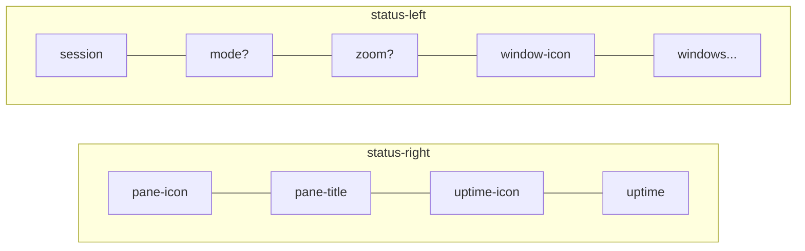

# CLAUDE.md

tmux config with custom Catppuccin Mocha status bar.

## Status Bar Layout



- **Session**: Teal tmux icon + session name (both teal)
- **Mode indicator**: Only shows in non-normal modes (prefix/copy/sync/tree/clock)
- **Zoom indicator**: Mauve zoom icon + "ZOOM" when pane is zoomed
- **Window icon**: Pink tab icon before window list
- **Windows**: Left-justified list (active=bold flamingo, last=lavender)
- **Pane title**: Blue terminal icon with pane title
- **Uptime**: Rosewater hourglass icon with `D:HH:MM` format (muted text)
- **Spacer**: Empty second status line separates bar from content

### Mode Indicators

| Mode | Icon | Label | Color |
|------|------|-------|-------|
| Normal | (hidden) | — | — |
| Prefix | rocket | TMUX | red |
| Copy | copy | COPY | blue |
| Sync | sync | SYNC | peach |
| Tree | list | — | teal |
| Clock | clock | — | mauve |

Priority: prefix > sync > tree > clock > copy > normal

### Window Indicators

| State | Style |
|-------|-------|
| Normal | subtext0 |
| Current | flamingo, bold |
| Last | lavender |
| Activity | Asterisk (*) suffix |
| Bell | red |

## Colors (`@cp-`)

All colors defined as Catppuccin Mocha hex values:

```bash
@cp-rosewater "#f5e0dc"  # Uptime icon
@cp-flamingo  "#f2cdcd"  # Current window
@cp-pink      "#f5c2e7"  # Window icon
@cp-mauve     "#cba6f7"  # Zoom indicator, clock mode
@cp-red       "#f38ba8"  # Prefix mode, bell
@cp-peach     "#fab387"  # Sync mode, current search match
@cp-yellow    "#f9e2af"  # Search matches
@cp-teal      "#94e2d5"  # Session, tree mode, messages
@cp-blue      "#89b4fa"  # Copy mode, pane icon, clock digits
@cp-lavender  "#b4befe"  # Last window, active pane border
@cp-text      "#cdd6f4"  # Popup text
@cp-subtext1  "#bac2de"  # Pane title text
@cp-subtext0  "#a6adc8"  # Normal windows
@cp-overlay1  "#7f849c"  # Muted text (uptime)
@cp-overlay0  "#6c7086"  # Inactive border, message/menu bg
@cp-surface1  "#45475a"  # Popup border
@cp-surface0  "#313244"  # Selection background
@cp-bg        "#1e1e2e"  # Popup background
@cp-crust     "#11111b"  # Search match foreground
```

## Style Helpers (`@style-`, `@bg-`)

Reusable style fragments:

```bash
@style-text      "fg=#{@cp-text}"      # Primary text
@style-muted     "fg=#{@cp-overlay1}"  # Muted/secondary text
@style-inactive  "fg=#{@cp-overlay0}"  # Inactive elements
@style-accent    "fg=#{@cp-mauve}"     # Accent color
@style-highlight "fg=#{@cp-lavender}"  # Highlight color
@bg-overlay      "bg=#{@cp-overlay0}"  # Overlay background
```

## Icons (`@i-`)

Nerd Font glyphs with trailing space:

| Icon | Variable | Unicode | Usage |
|------|----------|---------|-------|
| tmux | `@i-tmux` | `ebc8` | Normal mode |
| rocket | `@i-prefix` | `f427` | Prefix mode |
| copy | `@i-copy` | `f4bb` | Copy mode |
| sync | `@i-sync` | `f46a` | Synchronized panes |
| clock | `@i-clock` | `f43a` | Clock mode |
| list | `@i-tree` | `f03a` | Tree mode |
| zoom | `@i-zoom` | `f002` | Zoomed pane |
| tab | `@i-window` | `f04e9` | Window list header |
| terminal | `@i-pane` | `f489` | Pane title |
| hourglass | `@i-uptime` | `f4e3` | Uptime display |

## Module System

Modules use `#{E:@var}` expansion for nested variable resolution. Line continuation (`\`) used for readability.

### Mode Detection (`@mode-is-*`)

Boolean checks for debugging with `tmux display -p "#{E:@mode-is-prefix}"`:

```bash
@mode-is-prefix  # Client is in prefix mode
@mode-is-sync    # Panes are synchronized
@mode-is-tree    # In tree mode
@mode-is-clock   # In clock mode
@mode-is-copy    # In any special pane mode
```

### Styled Mode Indicators (`@mode-*`)

Pre-styled icon + label variables:

```bash
@mode-prefix  # Red rocket + "TMUX"
@mode-sync    # Peach sync + "SYNC"
@mode-tree    # Teal list (icon only)
@mode-clock   # Mauve clock (icon only)
@mode-copy    # Blue copy + "COPY"
@mode-normal  # Empty (hidden in normal mode)
```

### Module Variables (`@module-*`)

Composed modules expanded via `#{E:@module-name}`:

```bash
@module-session # Teal tmux icon + session name
@module-mode    # Priority cascade: prefix > sync > tree > clock > copy > (empty)
@module-zoom    # Mauve zoom icon + "ZOOM" (conditional)
```

## External Scripts

### tmux-uptime

OS-aware uptime script at `~/bin/tmux-uptime`:

- **macOS**: Uses `sysctl kern.boottime`
- **Linux**: Reads `/proc/uptime`
- **Output**: `D:HH:MM` format (e.g., `1:04:02`)

Called from status-right via `#(tmux-uptime)`.

## Key Bindings

| Binding | Action |
|---------|--------|
| `Ctrl+Space` | Prefix key |
| `Prefix+R` | Reload config |
| `Prefix+p/n` | Previous/next window (repeatable) |
| `Prefix+P/N` | Move window left/right (repeatable) |
| `Prefix+"` | Split vertical (current path) |
| `Prefix+%` | Split horizontal (current path) |
| `Prefix+[` | Enter copy mode |
| `v` (copy mode) | Begin selection |
| `C-v` (copy mode) | Toggle rectangle selection |
| `y` (copy mode) | Yank and exit |

## Other Settings

| Setting | Value | Purpose |
|---------|-------|---------|
| `mouse` | on | Mouse support |
| `mode-keys` | vi | Vi-style copy mode |
| `status-keys` | emacs | Emacs in command prompt |
| `history-limit` | 50000 | Scrollback buffer |
| `display-time` | 4000 | Message display (4s) |
| `status-interval` | 5 | Status refresh (5s) |
| `status` | 2 | Two status lines |
| `repeat-time` | 1000 | Repeatable timeout (1s) |
| `base-index` | 1 | Windows start at 1 |
| `pane-base-index` | 1 | Panes start at 1 |
| `renumber-windows` | on | Auto-renumber on close |
| `monitor-activity` | on | Detect background activity |
| `visual-activity` | off | Suppress activity messages |
| `focus-events` | on | Pass focus events |
| `aggressive-resize` | on | Resize per-window |

## File Locations

- **Config**: `~/.config/tmux/tmux.conf`
- **Uptime script**: `~/bin/tmux-uptime`
